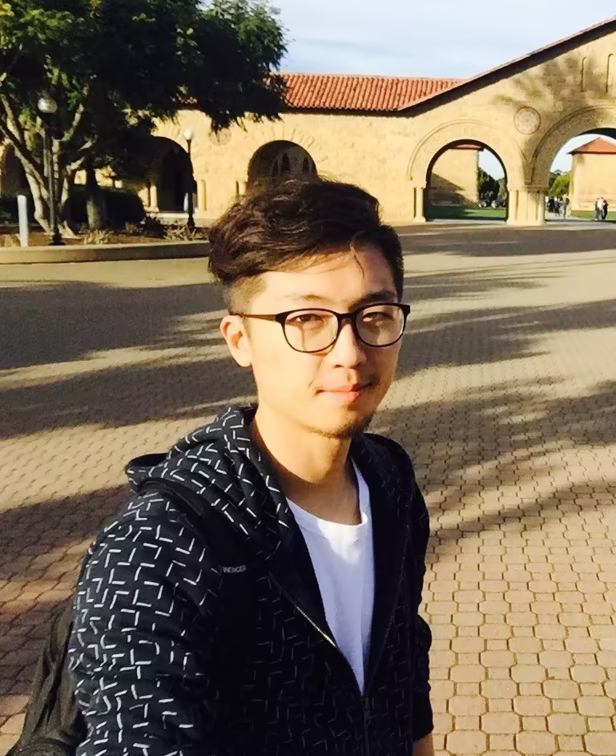

# **Yipeng Kang 坑易澎**

I am currently a researcher at [Beijing Institute for General Artificial Intelligence (BIGAI)](https://eng.bigai.ai/), under the leadership of [Prof. Songchun Zhu](https://zhusongchun.net/). I earned my PhD as an [Outstanding Graduate](优秀毕业生.jpg) from the Institute for Interdisciplinary Information Sciences (IIIS) at Tsinghua University, which is led by [Prof. Andrew Chi-Chih Yao](https://iiis.tsinghua.edu.cn/yao/). Additionally, I was a visiting scholar at CCLS, Columbia University and received my bachelor's degree from the University of Science and Technology of China.

Email: *kangyipeng[at]bigai[dot]ai*

<!-- ## Academic Background

- **Sep 2024 - Future:** Cambridge University (Incoming EE MPhil, supervised by [Prof. Ozgur B. Akan](https://ioe.eng.cam.ac.uk/directory/akan))
- **Sep 2020 - June 2024:** Maynooth University (BSc, EECS)
- **Sep 2020 - June 2024:** Fuzhou University (BEng, EECS)
- **June 2022 - Nov 2022:** Cambridge University (Internship) -->

---

## Research Interests
My main research interests lie at the intersection of natural language processing (NLP) and multiagent systems (MAS), with a particular focus on:
- Value system and alignment of large language models
- Social intelligence of language agents

---

## Recent Works
> (†: equal contribution)
- [Are the Values of LLMs Structurally Aligned with Humans? A Causal Perspective](https://arxiv.org/abs/2501.00581) **Yipeng Kang**, Junqi Wang, Yexin Li, Mengmeng Wang, Wenming Tu, Quansen Wang, Hengli Li, Tingjun Wu, Xue Feng, Fangwei Zhong, Zilong Zheng 

- [IBGP: Imperfect Byzantine Generals Problem for Zero-Shot Robustness in Communicative Multi-Agent Systems](https://arxiv.org/abs/2410.16237) Yihuan Mao†, **Yipeng Kang**†, Peilun Li, Ning Zhang, Wei Xu, Chongjie Zhang. AAMAS 2025 (Extended Abstract).

- [Multi-Agent Policy Transfer via Task Relationship Modeling](https://github.com/fringsoo/CGMIX) Rongjun Qin, Feng Chen, Tonghan Wang, Lei Yuan, Xiaoran Wu, **Yipeng Kang**, Zongzhang Zhang, Chongjie Zhang, Yang Yu. SCIS 2023 (CCF-A).

- [Multi-Agent Policy Transfer via Task Relationship Modeling](https://neurips.cc/virtual/2022/64142) Rongjun Qin, Feng Chen, Tonghan Wang, Lei Yuan, Xiaoran Wu, **Yipeng Kang**, Zongzhang Zhang, Chongjie Zhang, Yang Yu. NeurIPS 2022 Deep Reinforcement Learning Workshop.

- [Non-Linear Coordination Graphs](https://github.com/fringsoo/CGMIX) **Yipeng Kang**†, Tonghan Wang†, Qianlan Yang†, Xiaoran Wu, Chongjie Zhang NeurIPS 2022 (CCF-A). **Spotlight Paper**.

- [Incorporating Pragmatic Reasoning Communication into Emergent Language](https://fringsoo.github.io/pragmatic_in2_emergent_papersite/) **Yipeng Kang**, Tonghan Wang, Gerard de Melo NeurIPS 2020 (CCF-A). **Spotlight Paper**.

   

> Other works.
- [RAM: Towards an Ever-Improving Memory System by Learning from Communications](https://arxiv.org/abs/2404.12045) Jiaqi Li, Xiaobo Wang, Wentao Ding, Zihao Wang, **Yipeng Kang**, Zixia Jia, Zilong Zheng.  Reported by [麻省理工科技评论](https://m.weibo.cn/status/5069118812455700).

- [Reinforced Natural Language Interfaces via Entropy Decomposition](https://arxiv.org/abs/2109.11408) Xiaoran Wu, **Yipeng Kang** 

## Professional Services
Conference reviewer for NeurIPS 2023-2024, ICLR 2024-2025, etc.

## Other Experiences
- I was a **co-founder** of a start-up **Yishi-Tech**. 
(Some Awards [1](三创全国1.jpg)[2](三创全球.jpg)).

<!-- ziguang -->

- I was a freelance writer for **得到**. 
<!-- Proof -->

## Students

- PhD Students: 涂文明 (BIGAI & SJTU)
- Other Students with Collaboration:

    --IIIS, Tsinghua： 毛怡欢，杨乾澜

    --Tong Class, Tsinghua： 吴廷钧，高晗晴，汪上砚，陈子昂

<!-- 李可 -->

<!-- ## Degree Thesis

- [Hybrid Detection Mechanism for Spoofing Attacks in Bluetooth Low Energy Networks](https://caihanlin.com/mypaper/thesis/UG-thesis.pdf) **Hanlin Cai** (Advisor: Zhezhuang Xu). **Best Bachelor Thesis Award** (Top 1/300). Proposal paper has been accepted by AAAI 2024 Expect to submit a long paper to KDD 2024.

- [Industrial Inspection System based on Intelligent IoT and Bionic Quadruped Robot](https://caihanlin.com/mypaper/thesis/IP-report.pdf) **Hanlin Cai** (Advisor: Zhezhuang Xu, Yuxiong Xia). Junior-year Intern Program. Industrial Placement at China Huading Tech and IIoT Lab 

   

--- -->

---

<!-- ## News and Updates

- **June 2024**：Very excited to be selected as [KDD UC Scholar](https://kdd2024.kdd.org/call-for-undergraduate-consortium/). See you in Spain!
- **May 2024：**My undergraduate thesis won the Best Project Award (Top 1/300).
- **April 2024：**Our work *BLEGuard* has been accepted to [MobiSys 2024](https://www.sigmobile.org/mobisys/2024/) as a poster paper. See you in Japan!
- **March 2024：**Very excited to get a MPhil offer from Engineering department at Cambridge University!
- **Dec 2023：**Very excited to be selected as [AAAI UC Scholar](https://aaai.org/aaai-conference/undergraduate-consortium-program/). See you in Canada!
- **Aug 2023：**Happy to be awarded the FEPG Scholarship.
- **May 2023：**Happy to be awarded the XiamenAir Scholarship.
- **May 2023：**Collected the Finalist Award in MCM/ICM 2023 (Top 1%).
- **Jun 2022：**Started research programme at [Cambridge AI Group](https://www.cl.cam.ac.uk/research/ai/), advised by Prof. Pietro Liò. -->

> Update: 15th Sep 2024